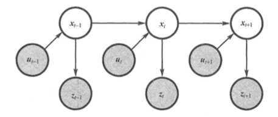
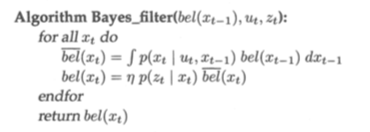

# 概率机器人学笔记

## 绪论

机器人通过传感器感知外部环境，然后通过驱动器执行行为，影响外部环境，在这过程中总是充满了各种不确定性。主要体现在五个方面：

1. 环境。物理世界的本质就是动态和不可预测的。
2. 传感器。传感器本身受限于物理规律，其次传感器本身存在噪声。
3. 机器人。机器人驱动器执行行为时存在噪声。
4. 模型。模型是对真实世界的抽象，其中必然存在误差。
5. 计算。由于计算资源的限制，常常通过近似的方法来达到低响应时间的目的。

## 递归状态估计

条件独立不意味着绝对独立：p(x,y∣z)=p(x∣z) p(y∣z) ≠ p(x,y)=p(x) p(y)

- 控制（u)、测量（z）、状态（x)：表征控制、状态和测批演变特征的动态贝叶斯网络

- 可信度（控制更新）：bel(xt) = p(xt ∣ z1:t, u1:t)
- 可信度（测量更新）：bel(xt)' = p(xt ∣ z1:t−1, u1:t)

基于马尔可夫假设 (Markov assumption) 或者完整状态假设 (complete state assumption)。

- 基本的贝叶斯滤波算法

- 贝叶斯滤波的数学推导（略）

需要确定测量概率 p(z_t ∣ x_t) 和状态转移概率 p(x_t ∣ u_t, x_t-1) 

