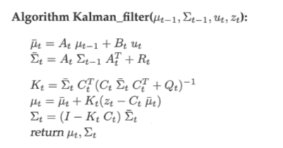
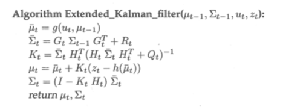
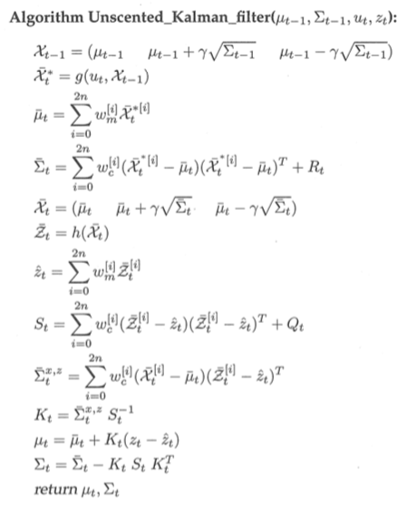
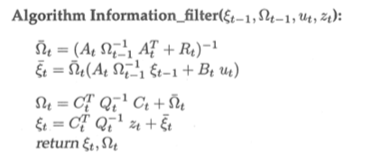
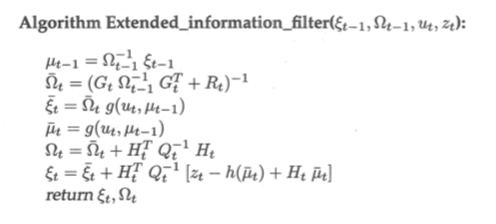

# 概率机器人学笔记

## 绪论

机器人通过传感器感知外部环境，然后通过驱动器执行行为，影响外部环境，在这过程中总是充满了各种不确定性。主要体现在五个方面：

1. 环境。物理世界的本质就是动态和不可预测的。
2. 传感器。传感器本身受限于物理规律，其次传感器本身存在噪声。
3. 机器人。机器人驱动器执行行为时存在噪声。
4. 模型。模型是对真实世界的抽象，其中必然存在误差。
5. 计算。由于计算资源的限制，常常通过近似的方法来达到低响应时间的目的。

## 递归状态估计

条件独立不意味着绝对独立：p(x,y∣z)=p(x∣z) p(y∣z) ≠ p(x,y)=p(x) p(y)

- 控制（u)、测量（z）、状态（x)：表征控制、状态和测批演变特征的动态贝叶斯网络

- 可信度（控制更新）：bel(xt) = p(xt ∣ z1:t, u1:t)
- 可信度（测量更新）：bel(xt)' = p(xt ∣ z1:t−1, u1:t)

基于马尔可夫假设 (Markov assumption) 或者完整状态假设 (complete state assumption)。

- 基本的贝叶斯滤波算法

- 贝叶斯滤波的数学推导（略）

需要确定测量概率 p(z_t ∣ x_t) 和状态转移概率 p(x_t ∣ u_t, x_t-1) 

## 高斯滤波

1. 线性卡尔曼滤波（证明，略）

> 第四行到第六行根据测量数据对预测值进行修正得到状态可信度。其中Kt称为卡尔曼增益。卡尔曼增益代表了观测数据对预测值的修正程度。Qt代表噪声δt的方差。

2. 扩展卡尔曼滤波（非线性；证明，略）

> 扩展卡尔曼滤波的关键就是对g和h函数进行线性化。常用的线性化方法是泰勒展开。

3. 无迹卡尔曼滤波（通过无迹变换实现线性化；证明，略）

4. 信息滤波（卡尔曼滤波的对偶滤波算法；证明，略）

> 卡尔曼滤波和扩展卡尔曼滤波是通过均值和方差来代表高斯分布，而信息滤波是通过信息矩阵和信息向量来表示的。表示如下：Ω=Σ^−1；ξ=Σ^−1·μ

5. 扩展信息滤波（非线性；证明，略）

## 非参数滤波

一种流行的能代替高斯的方法是非参数滤波 (nonparametric filters) 。与各种 高斯滤波不同，非参数滤波不依赖确定的后验函数。不过，非参数滤波通过有限 数量的值来近似后验。

1. 直方图滤波
2. 粒子滤波

## 机器人运动

由于控制噪声或者未建模的外源性影响，控制输出是不确定的。控制结果将用一个后验概率来描述。

对机器人的控制动作(motion)进行建模是计算状态转移概率 p(xt ∣ ut, xt−1) 的重要组成部分。

里程计模型往往比速度模型更精确，但是，里程计信息仅在执行完运动控制后才有能获得，因此它不能用于运动规划。

速度运动模型 (velocity motion model) 认为可以通过两个速度：一个旋转的和一个平移的速度，来控制机器人。

里程计运动模型虽然仍存在误差，但通常比速度更精确。两种都存在漂移和打滑，但是速度还受到实际运动控制器与它(粗糙的)数学模型之间的不匹配的影响。但是，里程计法只有在机器人移动后才是可用的。给出滤波算法是非常容易的，如后面将要讨论的定位和地图构建算法。但它使得信息不能用于精确的运动规划和控制。

## 机器人感知

地图信息通常有两种索引方式：基于特征的表示方法和基于位置的表示方法。

概率机器人要包容传感器模型的随机误差：将测量过程建模为一个条件概率密度 p(z|x)，而不是一个确定的函数 z=f(x)，传感器模型的不确定性可以被包含在模型的不确定部分。

---

# References

## [Book](https://github.com/lilinxi/CV-material/blob/master/books/%E6%A6%82%E7%8E%87%E6%9C%BA%E5%99%A8%E4%BA%BA%E5%AD%A6-2.pdf)

## [Note](https://zhehangt.github.io/tags/Probabilistic-Robotics/)

